# 🗜️ FilePad

> **Dontpad for ZIP files.** Create custom, instant URL-based workspaces to share ZIP archives. No accounts, no signups, no trackers—just raw, friction-free sharing.

<div align="center">
  
  [](https://vercel.com)
  [](https://supabase.com)
  [](https://developer.mozilla.org/en-US/docs/Web/JavaScript)
  [](https://opensource.org/licenses/MIT)

</div>

---

## ⚡ Quick Links
- [Architectural Design](#-architectural-design)
- [Core Features](#-core-features)
- [Supabase Setup & SQL Schema](#-supabase-setup--sql-schema)
- [Local Installation](#-local-installation)
- [Deployment on Vercel](#-deployment-on-vercel)
- [API Reference](#-api-reference)
- [Project Directory Structure](#-project-directory-structure)
- [Premium Aesthetics & UI Design](#-premium-aesthetics--ui-design)

---

## 🏗️ Architectural Design

FilePad utilizes a **modern, fully stateless, serverless-compatible architecture** designed to run effortlessly on edge platforms like **Vercel** with persistent data hosting provided by **Supabase**.

To bypass the traditional 4.5 MB request payload limits imposed by serverless functions, FilePad leverages a **Direct-to-Storage Upload workflow** via signed upload URLs. The client-side browser communicates directly with Supabase Storage, maintaining lightning-fast speeds and supporting massive file transfers.

### Upload Workflow Diagram

```mermaid
sequenceDiagram
    autonumber
    actor User as Client (Browser)
    participant Server as Express Serverless (Vercel)
    participant DB as Database (Supabase)
    participant Storage as Object Storage (Supabase)

    User->>Server: POST /api/:slug/upload-url
    Note over Server: Validates Slug & Generates Storage Path
    Server->>Storage: Request Signed Upload URL
    Storage-->>Server: Return Signed URL
    Server-->>User: Send Signed URL + Storage Path
    
    rect rgb(20, 20, 30)
        Note over User: Performs Client-Side Validation<br/>(Extension & Magic Bytes PK check)
        User->>Storage: PUT ZIP payload directly to Signed URL
        Storage-->>User: 200 OK Upload Successful
    end

    User->>Server: POST /api/:slug/confirm (filename, filesize, storagePath)
    Server->>DB: Insert File Record (linked to Space slug)
    DB-->>Server: File Inserted Success
    Server-->>User: Return Saved File Metadata JSON
    Note over User: Instantly refreshes UI list with new file
```



---

## 🚀 Core Features

- 🔗 **URL-Based Spaces:** Type any path (e.g., `filepad.com/my-workspace`) to instantly create or join a space. Dynamic validation guarantees URLs only consist of secure, friendly characters.
- 🎲 **Random URL Generator:** Don't know what to name your space? Generate a unique, memorable URL with a single click (e.g., `golden-echo-402`).
- 📁 **Multi-File Workspace:** Share multiple ZIP archives in a single space simultaneously.
- 🔒 **Direct Browser-to-Storage Uploads:** File transfers bypass the backend server entirely, allowing uploads of files up to **500 MB** without hitting serverless timeouts or payload caps.
- 🛡️ **Dual-Layer ZIP Verification:** 
  1. **Extension Check:** Strict client-side file extension checking.
  2. **Magic Byte Verification:** Inspects the file's binary header (`0x50 0x4B` - standard `PK` zip signature) in the browser before triggering upload, preventing spoofed files.
- ⏱️ **Auto-Expiry System:** To maintain a clean and self-pruning file footprint, an automatic worker scans records hourly and purges both the database entries and the stored assets **30 days** after upload.
- 📊 **Real-time Stats:** Track download counts, file size formatted dynamically, and relative uploaded-at timers.
- 📋 **Seamless Actions:** One-click copy space URL to clipboard, instant secure downloads through tokenized redirects, and instant physical deletions.

---

## 🛢️ Supabase Setup & SQL Schema

To self-host or configure FilePad, you need a **Supabase** project. Execute the following SQL schema in your Supabase SQL Editor and create the required storage bucket.

### 1. SQL Database Tables Schema
Copy and execute this script to set up the relational schema:

```sql
-- 1. Enable UUID Extension
create extension if not exists "uuid-ossp";

-- 2. Create Spaces Table
create table public.spaces (
    slug text primary key,
    created_at timestamptz default now() not null
);

-- Enable Row Level Security (RLS) for Spaces
alter table public.spaces enable row level security;
create policy "Allow public access to spaces" on public.spaces for all using (true);

-- 3. Create Files Table
create table public.files (
    id uuid default gen_random_uuid() primary key,
    space_slug text references public.spaces(slug) on delete cascade not null,
    filename text not null,
    filesize bigint not null,
    storage_path text not null,
    downloads integer default 0 not null,
    expires_at timestamptz not null,
    uploaded_at timestamptz default now() not null
);

-- Index for speedy queries by space
create index idx_files_space_slug on public.files(space_slug);

-- Enable Row Level Security (RLS) for Files
alter table public.files enable row level security;
create policy "Allow public access to files" on public.files for all using (true);
```

### 2. Storage Bucket Setup
1. Navigate to **Storage** in the Supabase Dashboard.
2. Create a new bucket named **`zip-files`**.
3. Set the bucket privacy to **Private** (Signed URLs are generated programmatically by the server for maximum security).
4. Create a Storage Policy to allow actions:
   - Allow **Select**, **Insert**, and **Delete** operations for anonymous/public roles, OR configure the API key access to bypass restriction.

---

## 💻 Local Installation

Setting up FilePad on your local machine takes under 3 minutes.

### 📋 Prerequisites
- **Node.js** (v18 or higher recommended)
- **NPM** (v9 or higher)

### 🛠️ Step-by-Step Run Guide

1. **Clone the Repository**
   ```bash
   git clone https://github.com/VivekKulkarnii/FilePad.git
   cd FilePad
   ```

2. **Install Dependencies**
   ```bash
   npm install
   ```

3. **Configure Environment Variables**
   Create a `.env` file in the root directory:
   ```env
   SUPABASE_URL=https://your-supabase-project.supabase.co
   SUPABASE_ANON_KEY=your-supabase-anon-public-key
   PORT=3000
   ```

4. **Launch the Development Server**
   To start the server with hot-reload enabled via `nodemon`:
   ```bash
   npm run dev
   ```

5. **Open Browser**
   Navigate to **[http://localhost:3000](http://localhost:3000)**.

---

## ☁️ Deployment on Vercel

FilePad is built out-of-the-box with full Vercel serverless function compatibility (`vercel.json` included).

### Deploying via Vercel CLI

1. **Install Vercel globally (if not already done):**
   ```bash
   npm install -g vercel
   ```

2. **Deploy to production:**
   ```bash
   vercel --prod
   ```

3. **Add Environment Variables:**
   During configuration or in the Vercel dashboard, make sure to add the following variables under Settings -> Environment Variables:
   - `SUPABASE_URL`
   - `SUPABASE_ANON_KEY`

---

## 🔌 API Reference

| Method | Endpoint | Description |
| :--- | :--- | :--- |
| **GET** | `/api/:slug/info` | Fetches the space details and lists metadata of all registered files inside the space. If the space does not exist, it is created instantly on-demand. |
| **POST** | `/api/:slug/upload-url` | Generates a high-security signed upload URL from Supabase Storage for the space, ensuring the user's browser can stream upload the ZIP directly. |
| **POST** | `/api/:slug/confirm` | Confirms a successful storage upload, generating and persisting a new file record linked to the space in the database (with a 30-day expiration timer). |
| **GET** | `/api/:slug/download/:fileId` | Increments the download counter in the database and redirects the browser via HTTP 302 to a secure, temporary, signed download URL. |
| **DELETE** | `/api/:slug/file/:fileId` | Deletes the ZIP file from the Supabase storage bucket and purges the file row metadata from the database. |
| **GET** | `/api/health` | A simple uptime and response time diagnostic endpoint for monitoring tools. |

---

## 📂 Project Directory Structure

```
FilePad/
├── public/                # Static assets served to the client
│   ├── index.html         # Elegant landing page with step indicators
│   ├── space.html         # Multi-file space workspace UI
│   ├── style.css          # Design tokens, variables, & styling rules
│   ├── home.js            # Landing page form interactions & random URLs
│   └── space.js           # Upload engine, magic-bytes parser, and API calls
├── server.js              # Serverless-compliant Express server & cron cleanups
├── vercel.json            # Vercel routing rules & node configuration
├── package.json           # Project dependencies & startup scripts
└── .env                   # Local configuration variables (git ignored)
```

---

## 🎨 Premium Aesthetics & UI Design

FilePad represents modern web aesthetics, heavily inspired by premium developer-centric design languages.

- 🌌 **Midnight HSL Canvas:** Structured entirely around custom HSL color values, featuring a sleek, dark-slate background with vibrant accents (emerald highlights, ruby warnings, sapphire primary elements).
- 🧬 **Background Orbs:** Custom, dynamic, and fluidly animated CSS gradients that act as ambient glowing orbs behind elements, providing depth and futuristic space vibes.
- ❄️ **Glassmorphism:** Navigation bars, panels, and dropzones are styled with frosted-glass translucent borders (`backdrop-filter: blur(16px)`), giving a tactile, polished feel.
- 🏎️ **Micro-Animations:** Fluid, interactive button transitions, smooth dropzone animations on drag-over, and instant copy-to-clipboard alerts with beautiful slide-in states.
- ⚡ **Zero Framework Overhead:** The application uses raw, unadulterated HTML5, ES6+ Javascript, and pure CSS, making the entire website load within a fraction of a second.

---

## 📄 License
This project is open-source and licensed under the **[MIT License](LICENSE)**. Feel free to fork, adapt, and build upon it!
